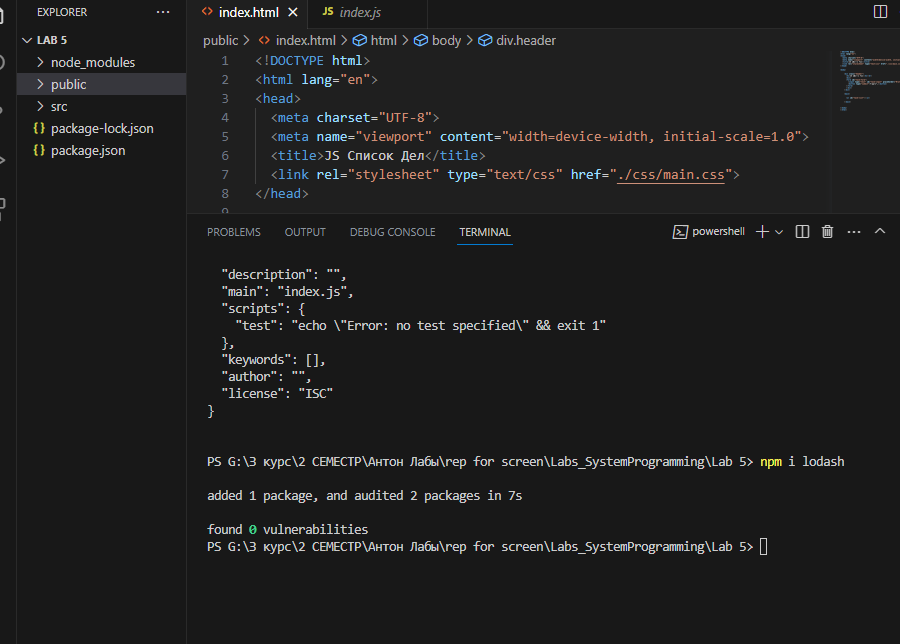
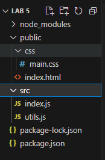
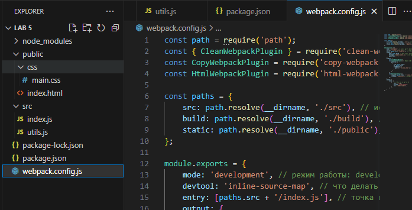
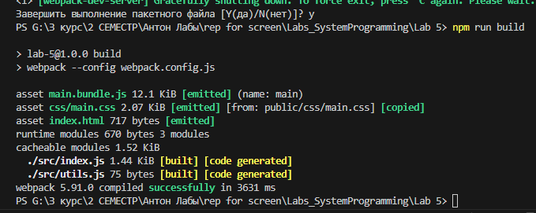

# Лаба 5. Настройка инфраструктуры. Сборка проекта и установка зависимостей
- [`Task`](#task)
- [`Отчет`](#отчет)
## Task
> Для лабы: <a href="https://github.com/goryachkinama/web-lectures/blob/main/src/lab_7_webpack.md">Настройка инфраструктуры. Сборка проекта и установка зависимостей</a>

### Задание по проекту TODO-list:

0. Открыть в своей TODO-list как проект (можно выполнить нижеперечисленные шаги на пустом проекте, но позже придется переносить в него все файлы из TODO-list)
1. Проверить и установить, если требуется NodeJS (проверить через "node -v" в терминале IDE)
2. Сгенерить/создать package.json ("npm init -y")
3. Поставить и удалить библиотеку lodash ("npm i lodash", "npm un lodash"): убедиться, что работает установка библиотек
4. Поставить Webpack и создать webpack.config.js
5. Особое внимание к структуре проекта (!) Файлы js, css,и html нужно складывать четко соблюдая дерево папок из примера.
   Если что-то не будет совпадать, Webpack не отработает
7. В package.json прописать скрипты для старта и сборки проекта:
  "start": "webpack-dev-server --config webpack.config.js",
  "build": "webpack --config webpack.config.js"
8. Убедиться, что скрипты работают ("npm run start", "npm run build"), проект стартует на http://localhost:8080
9. В файле .gitignore указать игнорируемые при коммите папки

## Отчет

1. Проверяем наличие node

  

2. Создаем `package.json` через 
    ```
    npm init -y
    ```
     

3. Ставим библиотеку `lodash`

       

4. Удаляем библиотеку `lodash`

   

5. Создаем новый js файл `utils` 
    

    *  Структура файлов:

        

6. Устанавливаем необхожимые библиотеки webpack
    * Библиотека 1:
        ```
        npm i -D webpack webpack-cli webpack-dev-server
        ```

        

     * Библиотека 2:
        ```
        npm i -D webpack-merge babel-loader clean-webpack-plugin
        ```

        
    
     * Библиотека 3:
        ```
        npm i -D copy-webpack-plugin html-webpack-plugin @babel/core
        ```

        

7. В package.json прописываем скрипты для старта и сборки проекта

     

8. Создаем `./webpack.config.js`

     

9. `npm run start` -
    * Консоль:
     
    * Браузер:
       

10. `npm run build` -
    * Консоль:
     

    * Новая сбилденная папка `build`:

          
