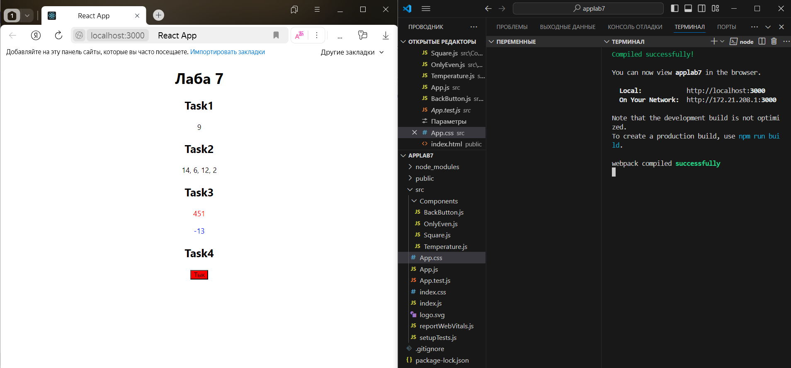
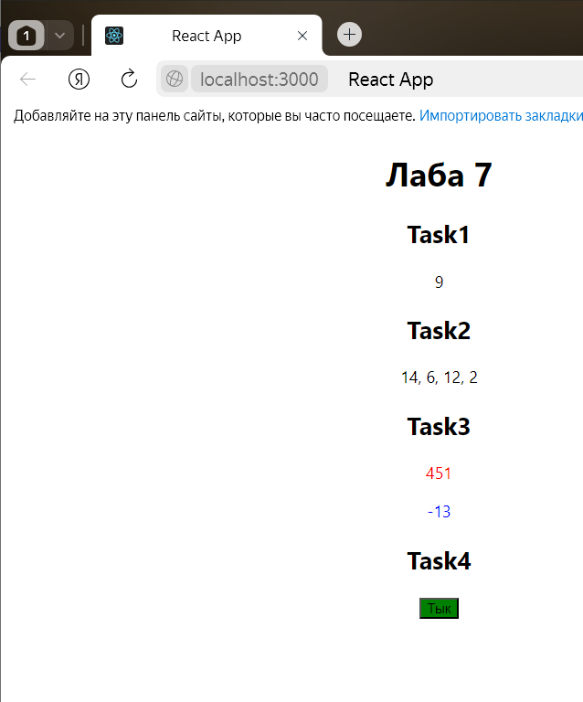

# Лаба 7. Введение в React
- [`Task`](#task)
- [`Отчет`](#отчет)
## Task
> Для лабы: <a href="https://github.com/goryachkinama/web-lectures/blob/main/src/lab_9_react.md#лабораторная-9-введение-в-react">Введение в React</a>


## Отчет

1. Создеаем проект через cmd.
   ```
   npx create-react-app %имя_приложения%
   ```

2. Все компоненты из заданий в папке `Components`
   
3. Запускаем через

    ```
    npm start
    ```

4. Вид:

   

5. Смена фона кнопки при нажатии 
    

  